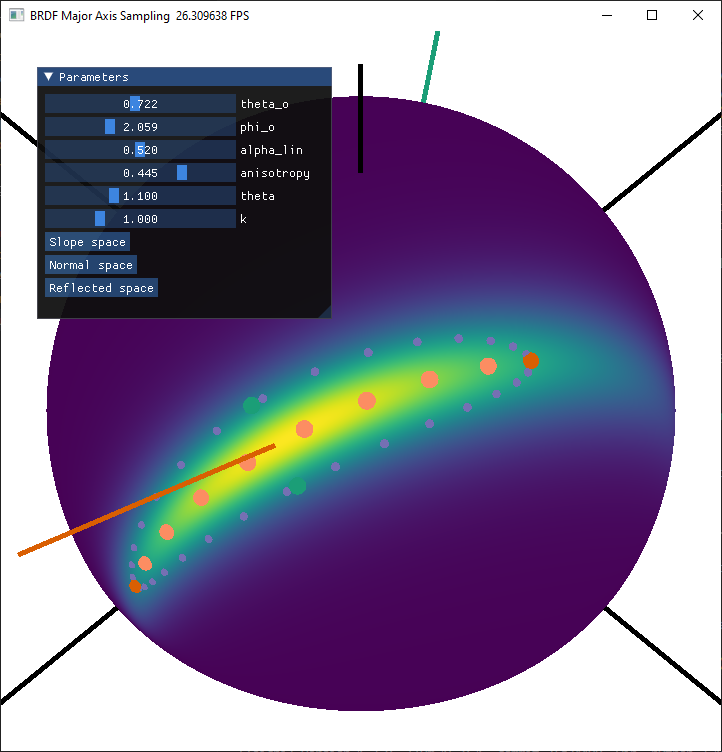
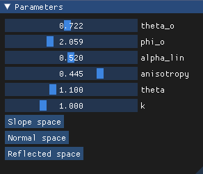
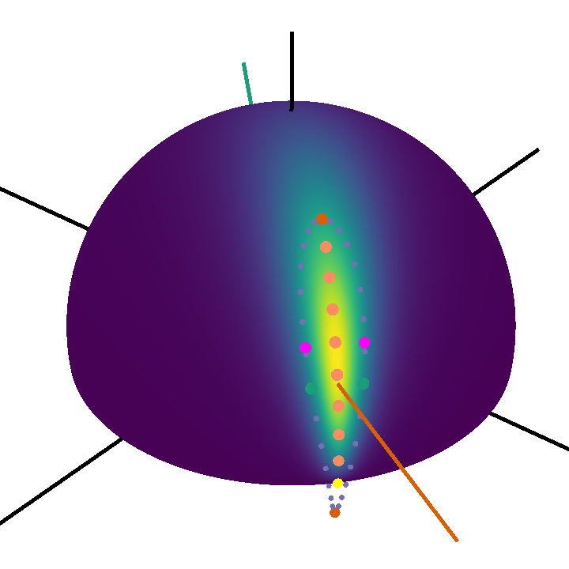

# Specular BRDF Major Axis Visualizer for Image-Based Lighting



This repository contains the specular BRDF major axis visualizer referenced in the article:

**[Anisotropic Specular Image-Based Lighting Based on BRDF Major Axis Sampling](https://xavierchermain.github.io/publications/aniso-ibl)**

Giovanni Cocco $^{1}$ $^{2}$, [Cédric Zanni](https://members.loria.fr/CZanni/)$^{2}$, and [Xavier Chermain](https://xavierchermain.github.io)$^{2}$

$^{1}$ University of Milan

$^{2}$ [Université de Lorraine](https://www.univ-lorraine.fr/en/univ-lorraine/), [CNRS](https://www.cnrs.fr/en), [Inria](https://www.inria.fr/en), [Loria](https://www.loria.fr/en/)

[Pacific Graphics 2024](http://pg2024.hsu.edu.cn/)

- [Project page](https://xavierchermain.github.io/publications/aniso-ibl)
- [Article](https://drive.google.com/file/d/1j_NFhLSngmOycLUZ2mTV_lCL_a4NXBTb/view?usp=sharing)
- [Supplemental Video](https://youtu.be/Z_WuhOlMXBs)

# Prerequisites

- **Python**: 3.7 - 3.11 (64-bit)
- **OS**: Windows, OS X, or Linux (64-bit)

# Installation

1. Clone the Repository

To clone the repository, run:
```bash
git clone https://github.com/xavierchermain/brdf_major_axis.git
```

2. Install Python Dependencies

Install the required Python modules:

```bash
pip install taichi numpy
```

# Visualize Specular BRDF Major Axis

## Run the Visualizer

Execute the following command to start the visualizer:
``` bash
python visualize.py
```

## Graphical User Interface Parameters



- `theta_o`: Polar angle of the view/outgoing direction.
- `phi_o`: Azimuthal angle of the view/outgoing direction.
- `alpha_lin`: Linear roughness parameter, denoted as $\alpha_{\text{lin}} \in [0.045, 1]$ in the article.
- `anisotropy`: Amount of roughness anisotropy $\eta \in (-1, 1)$. Refer to Section 4.1 of the article.
- `theta`: Angle in radians of the microsurface anisotropic orientation $\overline{U}$. See Figure 5 in the article.
- `k`: Controls the amount of density included in the confidence region. It acts as the scale factor for the ellipse representing the confidence region boundary. See Sections 5.2 and 5.8 for more details.
- `Slope space`, `Normal space` and `Reflected space` buttons: Allow switching between slope, normal, and reflected spaces. By default, the reflected space is displayed. For more details, refer to Section 5.1 of the article.

## Data



- The **viridis colors** on the hemisphere represent the density of:
  - the **slope distribution function** (slope space),
  - the **projected normal distribution function** (normal space), or
  - the **cosine-weighted BRDF** (reflected space, as shown in the previous image). See Figure 7 of the article.
- **Black lines**: Tangent frame.
- **Green line**: View/outgoing direction.
- **Orange line**: Reflection direction, also known as the mirror direction.
- **Light orange dots**: BRDF major axis samples, denoted as $\omega_j$ in the article.
- **Purple dots**: Confidence region boundary $\mathcal{E}$, also referred to as the ellipse.
- **Dark orange dots**: Confidence region's farthest extrema, denoted as $\omega_{\top 0}$ and $\omega_{\top 1}$ in the article.
- **Yellow dot**: Clamped farthest extremum, $\omega_{\top}'$
- **Green dots**: Confidence region's closest extrema, denoted as $\omega_{\bot 0}$ and $\omega_{\bot 1}$.
- **Purple dots**: Shifted confidence region's closest extrema, denoted as $\omega_{\bot 0}'$ and $\omega_{\bot 1}'$.

# Main Files and Functions

- [`microfacet.py`](microfacet.py): Contains the key functions used for computing the confidence region boundary extrema needed to sample the BRDF major axis.
  - `compute_extrema_t0_and_t1()`: Solves Equation 7 from the article, corresponding to the implementation of Appendix A.
  - `clamp_major_axis()`: Clamps the major axis, as outlined in Appendix B.
- [`visualize.py`](visualize.py): Main file for running the visualizer, which displays the microfacet BRDF confidence area and major axis.
